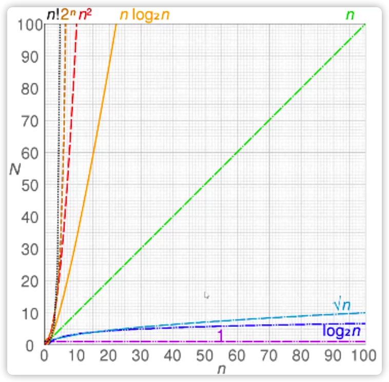

## 数据结构与算法

掌握数据结构和算法，可以使我们在工作中，对复杂系统有更好的设计。

在学习数据结构和算法时，结合场景进行实战，多总结，对时间/空间复杂度进行分析和优化。

按联系分数据结构：有序的（栈、队列、链表），无序的（集合、字典），有一定联系的（树、图、堆）

数据结构和算法的关系（个人理解）：
计算机里，要合理设计数据结构，算法为数据结构服务，算法离不开操作数据结构

生活中的应用场景：
浏览器里的前进、后退，数学计算里的加减乘除和括号，它们是栈的结构
食堂打饭排队，上下班坐班车排队，它们是队列结构
火车站广场上的旅客，它们是集合的结构
公司的组织架构、文件夹的目录，它们是树的结构
世界上的飞机航线图，微信朋友圈，是图的结构

上面提到算法为数据结构服务，那么不同的数据结构有那些对应的算法？
链表：遍历链表、删除链表节点
树、图：深度/广度优先遍历
数组：排序、搜索（顺序/二分）

## 时间复杂度

时间复杂度可以理解为一个函数，用O来表示。它定性地描述该算法的运行时间。



```js
// O(logN)
let i = 1
while (i < n) {
  console.log(i)
  i *= 2
}

```

## 空间复杂度

空间复杂度也可以看做一个函数，用大O表示，O(1)、O(n)、O(n^2)...
表示该算法在运行过程中临时占用存储空间大小的量度

```js
// O(n^2)
const matrix = []
for (let i = 0; i < n; i ++) {
  matrix.push([])
  for(let j = 0; j < n; j++) {
    matrix[i].push(j)
  }
}
```

## 栈

js里没有栈这种数据结构，但可以用Array来实现栈的所有功能。

什么场景下用栈？
适合后进先出特点的都可以用栈。
例如：进制转换（十进制转二进制）、判断字符串的括号是否有效、js中函数调用堆栈、二叉树的前序遍历


关于栈的算法
总结，思考

